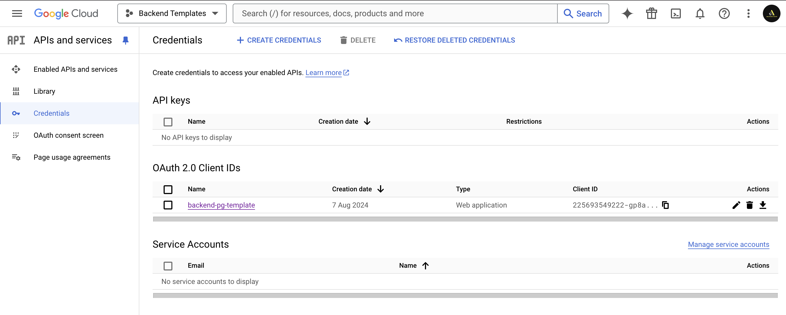
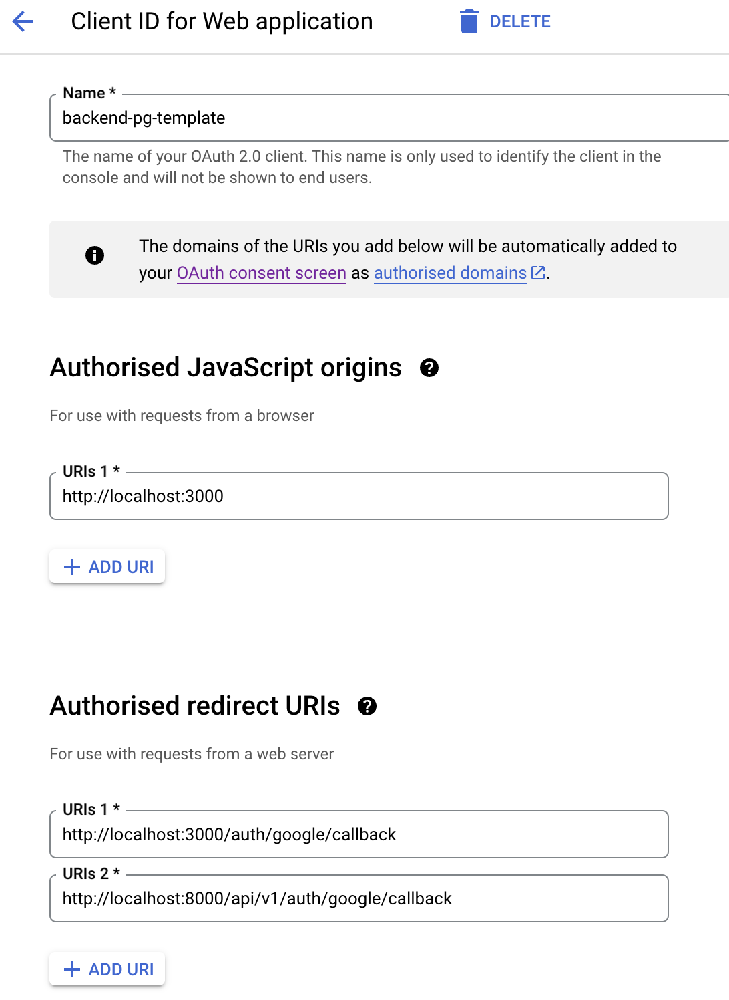

# OAuth2.0 Frontend App

This App implements the OAuth for both

1. Google
2. Apple

This project was bootstrapped with [Create React App](https://github.com/facebook/create-react-app).

## Steps to run the app [In localhost]

1. clone the backend repo from here: [nest-pg-typeorm-template](https://github.com/debiprasadmishra50/nest-pg-typeorm-template)
2. Follow the running process for the app and start the backend app at port 8000
3. Setup the Google Cloud Console: [Link](https://console.cloud.google.com/apis/credentials)
4. Create a OAuth 2.0 Client IDs

   

5. Add the JavaScript Origins andredirect URLs

   

6. Start the app using `npm start`

## Available Scripts

In the project directory, you can run:

### `npm start`

Runs the app in the development mode.\
Open [http://localhost:3000](http://localhost:3000) to view it in the browser.

The page will reload if you make edits.\
You will also see any lint errors in the console.

## Learn More

You can learn more in the [Create React App documentation](https://facebook.github.io/create-react-app/docs/getting-started).

To learn React, check out the [React documentation](https://reactjs.org/).

## Stay in touch

- Author - [Debi Prasad Mishra](https://www.debiprasadmishra.net/)

## License

This App is [MIT licensed](LICENSE).
